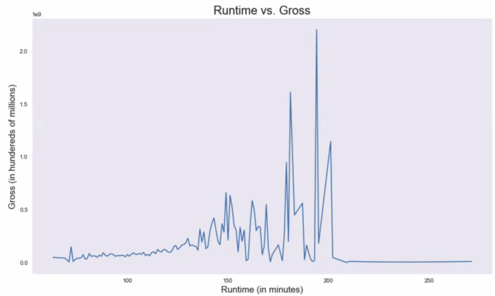
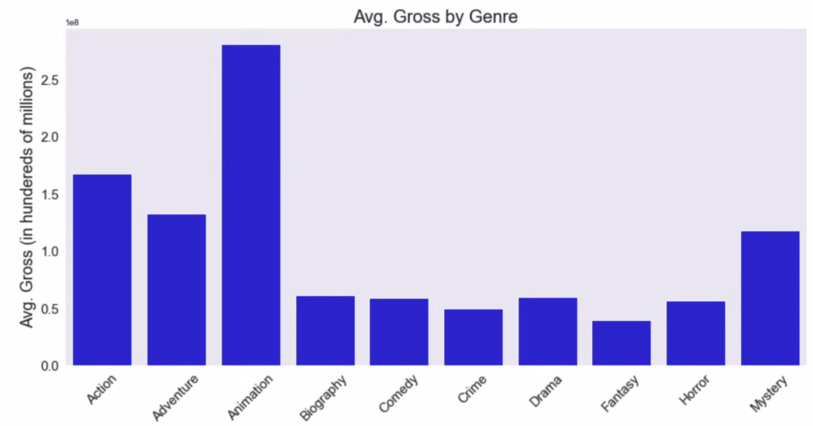
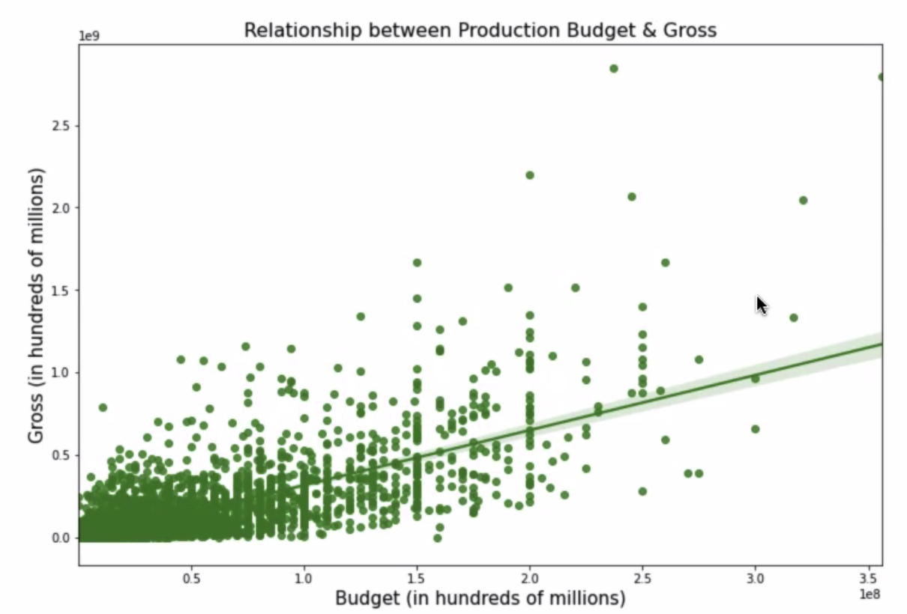
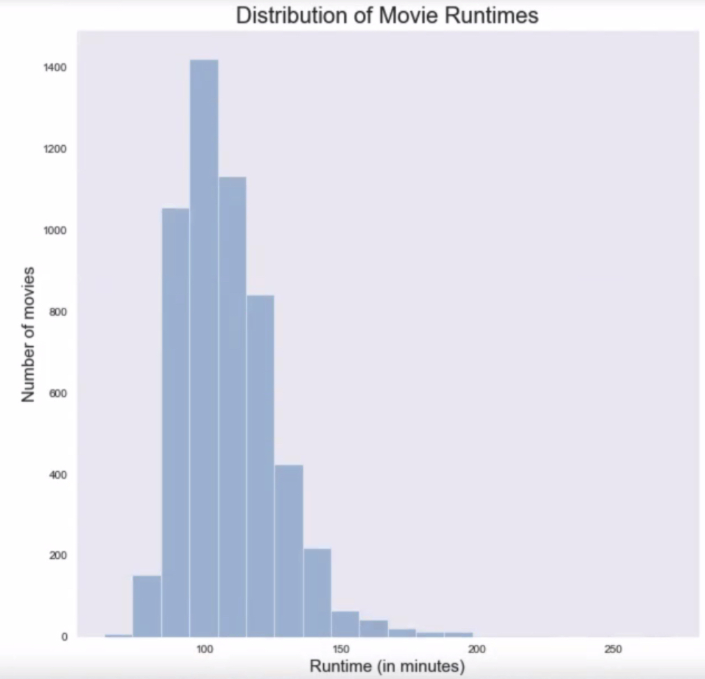
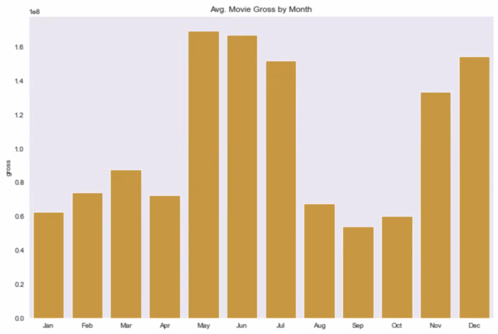

## Overview

Making a debut into the movie industry can be expensive, even for a company like Microsoft. The success of the first movie will make an impression on the community and affect the success for future productions. This study aims to provide the information necessary for Microsoft to produce a movie that grabs attention and generate high gross revenue. The journal covers the correlation between budget and gross. Both the length of a movie and type of genre also have an influence to the gross revenue. The business recommendations are backed by using movie information gathered from 1986 to 2016. Suggestions will be made for how much money should be invested into production, how long the movie should be, and which genre should the movie be categorized as.

***
---

## Business Understanding

Microsoft wants to create a sucessful movie studio and need to make a strong impression to the industry. The first step to create a strong impression is to release a movie that takes the box office by storm. The success of movies are measured by critque, popularity, and gross revenue generated.

Business questions:

* How can this studio create a first successful movie?
* What has historically made a successful movie?
* After development, when should the movie be released?

***
---

## Data Understanding

The dataset is sourced from Kaggle which provided information scraped from IMDb from years 1986 to 2016. Browsing the data, it was concluded that the data most useful for Microsoft to generate a successful movie would be: 
* Budget spent
* Runtime (duration of movie)
* Genre

Secondary analysis could be done on the popularity and score of the movies listed, which indirectly leads to more tickets sold. It should be noted that the gross revenue is only considering the USA revenue and does not account for inflation.

***
---

## Data Cleaning and Decisions

The dataset from Kaggle was nearly complete for the purpose of the analysis but did have some missing values. The rows that had missing values were removed and the non-relevant columns were dropped from the dataset. Organizing the data showed that some genres would mislead the analysis, so the genre categories with less than ten entries would be removed for analysis.

Alterations made to raw dataset:
* Removed rows with missing entries
* Removed out of scope columns
* Removed genre categories based on sample size

***
---

## Data Visualization

The Runtime vs. Gross graph (Figure X) shows that not many movies over 200 minutes generates much revenue. 

")

***
---

## Data Analysis

As shown in Figure X, there is a positive correlation between budget and gross revenue. Using the 25th and 75th percetile of budget spent to determine this range, a movie spending between \$10,000,000 to \$45,000,000 can expect \$18,926,942 to \$58,424,237 in return.

It is natural that movies with long runtimes will deter viewers from watching the movie. Movies that are too short though historically do not generate much revenue. The ideal length a movie should be is anywhere between 130-180 minutes. Movies with the genre being a biography or drama may still attract viewers with long runtimes while still generating high revenue.

The best performing movies have been animations, action, and adventure movies. As of late, these genres have been the popular genres released and seems to be what attracts the community to the box office. 

***
---

## Results

***
---

## Recommendations

***
---

## Further Possible Disucssions

***
---

## Conclusion

***
---

## Appendix

### Links

Presentation slides: https://docs.google.com/presentation/d/1yVWoNl7zq3NCI69Vr_woc0QGA1PlrXrfpS6YgDYsij0/edit?usp=sharing

Source for dataset: https://www.kaggle.com/danielgrijalvas/movies

### Additional graphs

