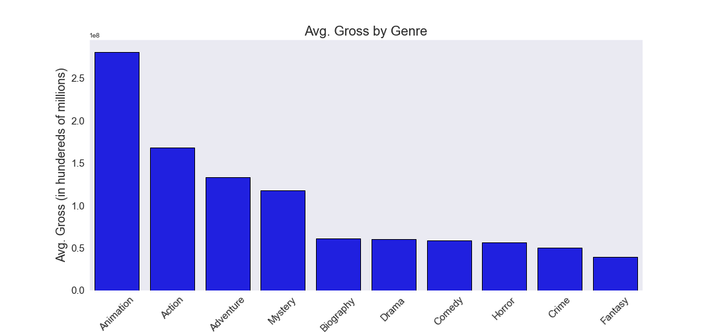
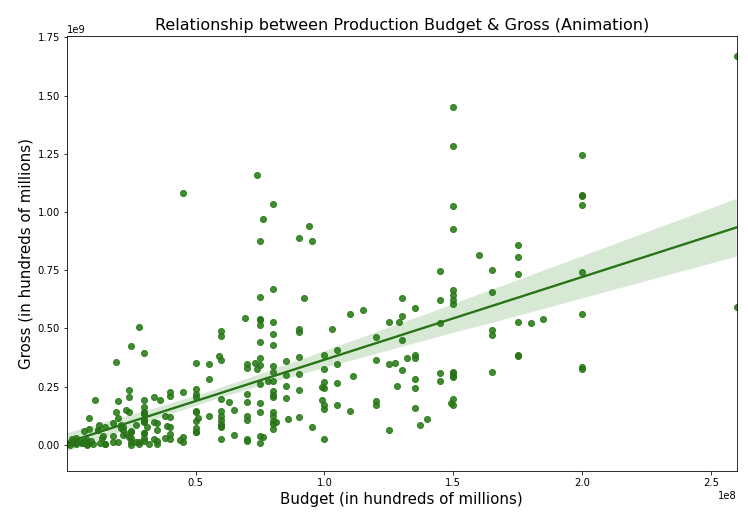
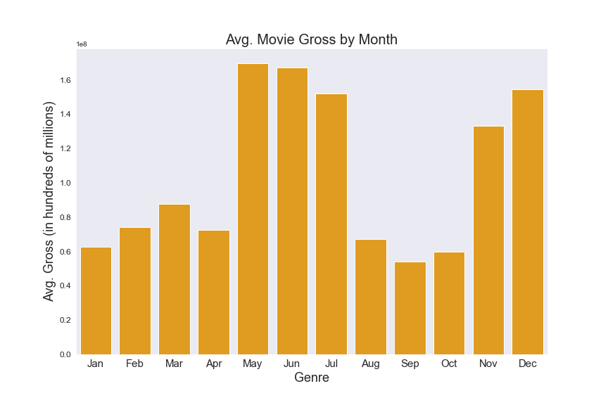

## Overview

Making a debut into the movie industry can be expensive, even for a company like Microsoft. The success of the first movie will make an impression on the community and affect the success for future productions. This study aims to provide the information necessary for Microsoft to produce a movie that grabs attention and generate high gross revenue. The journal covers the correlation between budget and gross. Both the length of a movie and type of genre also have an influence to the gross revenue. The business recommendations are backed by using movie information gathered from 1986 to 2016. Suggestions will be made for how much money should be invested into production, how long the movie should be, and which genre should the movie be categorized as.

***
---

## Business Understanding

Microsoft wants to create a successful movie studio and need to make a strong impression to the industry. The first step to create a strong impression is to release a movie that takes the box office by storm. The success of movies are measured by critique, popularity, and gross revenue generated.

Business questions:

* How can this studio create a first successful movie?
* What has historically made a successful movie?
* After development, when should the movie be released?

***
---

## Data Understanding

The dataset is sourced from Kaggle which provided information scraped from IMDb from years 1986 to 2016. Browsing the data, it was concluded that the data most useful for Microsoft to generate a successful movie would be: 
* Budget spent
* Runtime (duration of movie)
* Genre

Secondary analysis could be done on the popularity and score of the movies listed, which indirectly leads to more tickets sold. It should be noted that the gross revenue is only considering the USA revenue and does not account for inflation.

***
---

## Data Cleaning and Decisions

The dataset from Kaggle was nearly complete for the purpose of the analysis but did have some missing values. The rows that had missing values were removed and the non-relevant columns were dropped from the dataset. Organizing the data showed that some genres would mislead the analysis, so the genre categories with less than ten entries would be removed for analysis.

Alterations made to raw dataset:
* Removed rows with missing entries
* Removed out of scope columns
* Removed genre categories based on sample size

***
---

## Data Visualization

The best performing movies have been animations, action, and adventure movies. As of late, these genres have been the popular genres released and seems to be what attracts the community to the box office. 

There is a positive correlation with the amount of money spent on a movie and the returns it receives.

It is natural that movies with long runtimes will deter viewers from watching the movie. Movies that are too short though historically do not generate much revenue. There seems to be a sweetspot for the runtime length of an animated film, being 91 minutes.

Movies from 1986 - 2016 released in early summer (May, June, or July) and the holiday season (November and December) performed well in the box office

***
---

## Recommendations

### Short-term Priorities

Use the provided analytics to produce a 90 minute movie that falls under the animation, adventure, or action genre. Prepare to budget roughly \$150 million for production and marketing. For release of the movie, it would be best to launch the movie during the early summer or holiday season. Using this skeleton for the first movie will better position itself to be a success in the box office.

### Long-term Priorities

Animations seem to be the popular genre released. To keep with the times, Microsoft should set their long-term goals to developing a robust animation studio. It will be in their best interest to keep primary releases as animated films with possibility to explore live action in the future. The focus for the future should be making a name for itself in the film industry as a studio that creates adventurous, action-packed animations.

***
---

## Further Possible Disucssions

Additional studies could be conducted to create further recommendations. With more recent data, the movie industry could be assessed with the impact of COVID-19. Conducting this study might show that the box office is not the best place to release a movie. Rather an online streaming service may be the platform to release a movie. If developing a platform for Microsoft's film releases, another study could be conducted to see the benefits of introducing indie studios exclusive to the platform.

***
---

## Conclusion

Microsoft can create a studio that releases a strong first movie. Animated films historically perform better than other genres. Having a higher budget taps into a higher range of profits gained. Animation movies also tend to be released with 80-100 minute runtime length. Finally, releasing the movie during early summer or holiday seasons will improve the chances for a successful movie.

***
---

## Appendix

### Links

Presentation slides: https://docs.google.com/presentation/d/1yVWoNl7zq3NCI69Vr_woc0QGA1PlrXrfpS6YgDYsij0/edit?usp=sharing

Source for dataset: https://www.kaggle.com/danielgrijalvas/movies

### Additional graphs

